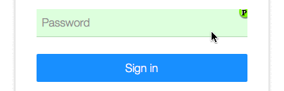

# Password Composer

The Password Composer gives users the possibility to remember one single
password for multiple web sites.

## Summary

Create a unique, secure password per site by hashing a Master Password
and the website domain.

## Usage

Double click the password field on a web page to open the Password Composer
panel, input your Master Password and press <kbd>Return</kbd> to generate the
website-specific password.

## Installation

The script installs in your web browser and requires either
[Greasemonkey][grease-site] or [Tampermonkey][tamper-site] extension to work.

After installing the browser extension, browse to the Password Composer
user script [source][pwdc-source] and follow instructions.

## Compatibility

Browsers that support user scripts and implement ECMAScript 6.  
Password Composer is tested to work with:

### Mozilla Firefox:

 + [Firefox](https://getfirefox.com/) 45+
 + [Grasemonkey][grease-inst] 3.7+

### Google Chrome:

 + [Chrome](https://www.google.com/chrome/) 50+
 + [Tampermonkey][tamper-inst] 4.0+

## Credits

Based on work by Nic Wolff and Johannes la Poutré.

See the [CREDITS](CREDITS) file for a full list of contributors.

[grease-site]: http://greasespot.net
[grease-inst]: https://addons.mozilla.org/en-US/firefox/addon/greasemonkey/
[tamper-site]: https://tampermonkey.net
[tamper-inst]: https://chrome.google.com/webstore/detail/tampermonkey/dhdgffkkebhmkfjojejmpbldmpobfkfo
[pwdc-source]: https://github.com/lkraider/password-composer/raw/master/password_composer.user.js
